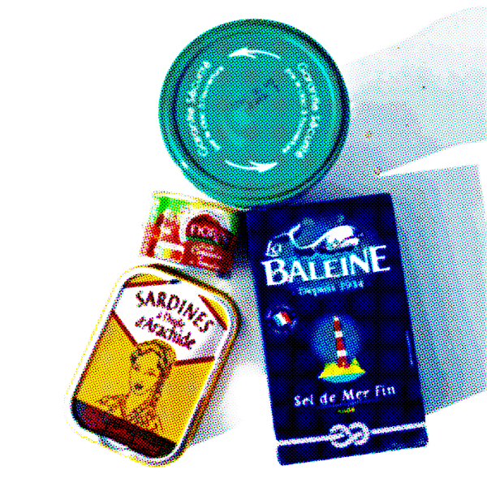
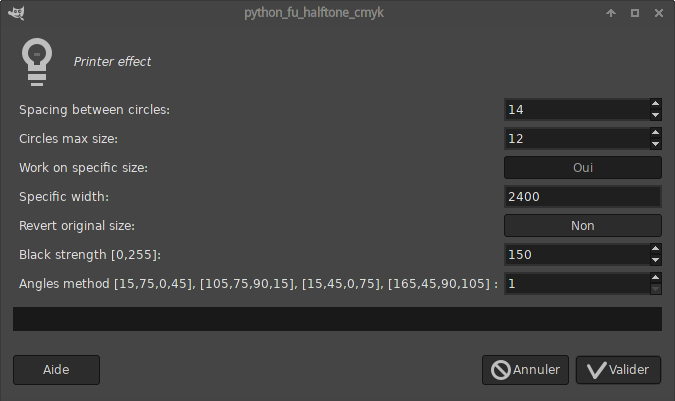

# cmyk_halftone_filter_gimp
### Presentation
A gimp python filter which mimic a cmyk halftone reprographic technique
* [Some documentation here]
(https://en.wikipedia.org/wiki/Halftone)

### Installation
Copy halftone_cmyk.py in your local plug-ins gimp path which can be found in Gimp preferences
(generally .config/GIMP/2.10/plug-ins). The filter should appear under 
"Python-fu>rodoc>Halftone CMYK"

### Parameters

